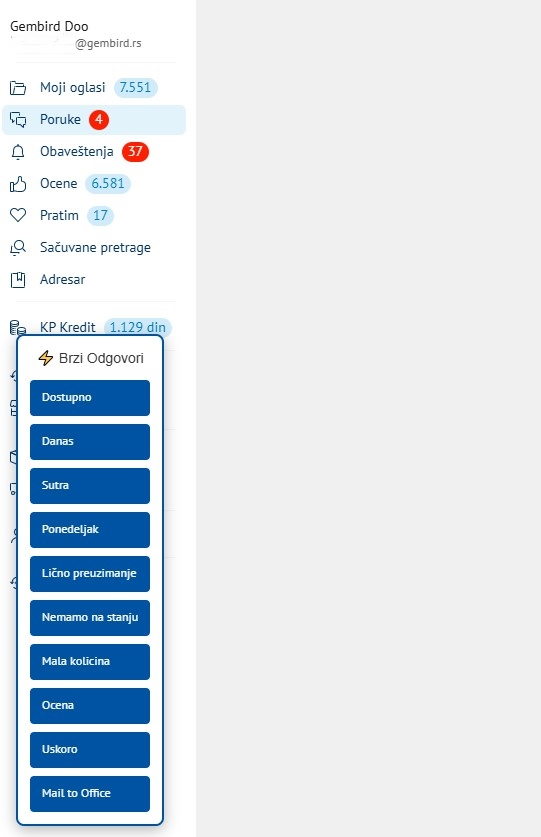

# KP Brzi Odgovori

Chrome ekstenzija koja dodaje widget sa dugmićima za brze, unapred definisane odgovore kupcima na **KupujemProdajem** i **Kupindo** porukama.

## Problem koji rešava

Veliki deo komunikacije sa kupcima preko KupujemProdajem i Kupindo poruka se svodi na iste, ponavljajuće odgovore - potvrda dostupnosti, obaveštenje o slanju (danas/sutra/ponedeljak), informacije o ličnom preuzimanju, obaveštenje da artikla nema na stanju, i slično. Ranije je to zahtevalo odlazak do posebnog tekstualnog fajla sa šablonima, kopiranje i lepljenje odgovora u poruku - za svaku poruku iznova.

## Kako radi

Ekstenzija ubacuje mali plutajući widget direktno na stranicu razgovora, sa dugmićima za svaki tip odgovora (Dostupno, Danas, Sutra, Ponedeljak, Lično preuzimanje, Nemamo na stanju, Mala količina, Ocena, Uskoro, Mail to Office). Klikom na dugme, odgovarajući tekst se automatski ubacuje u polje za poruku - spreman za slanje, bez kucanja i bez copy-paste-a.

Widget ostaje aktivan i kada se sadržaj stranice dinamički osveži (npr. pri prelasku na drugu poruku), zahvaljujući proveri koja se ponavlja svake sekunde.

## Izgled u praksi

## Korišćene tehnologije

- Chrome Extension Manifest V3
- Vanilla JavaScript (DOM manipulacija, dinamičko ubacivanje teksta u textarea/contenteditable polja)
- CSS za stilizovanje plutajućeg widgeta

## Napomena o razvoju

Ovaj projekat je nastao iz stvarne potrebe na poslu, gde sam identifikovao problem i testirao rešenje u praksi. Pri pisanju samog koda koristio/la sam AI pomoć da naučim kako funkcioniše Chrome Extension arhitektura i DOM manipulacija. Razumem logiku i strukturu projekta, i i dalje aktivno učim finije detalje JavaScript-a kao junior programer.

## Instalacija (za testiranje)

1. Otvori `chrome://extensions` u Chrome-u
2. Uključi **Developer mode** (gore desno)
3. Klikni **Load unpacked** i izaberi folder sa ovim fajlovima
4. Otvori razgovor na kupujemprodajem.com ili kupindo.com

## Moguća unapređenja

- [ ] Mogućnost da korisnik sam uređuje/dodaje šablone odgovora kroz interfejs, umesto direktno u kodu
- [ ] Zamena `setInterval` provere nečim efikasnijim (npr. `MutationObserver`)
